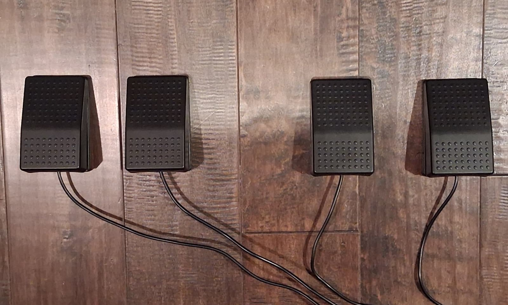
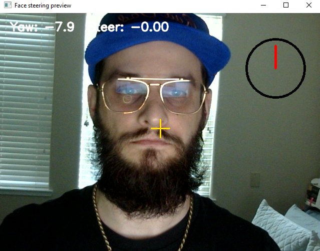
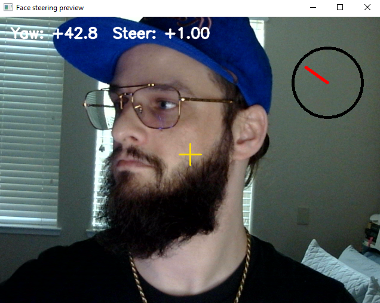
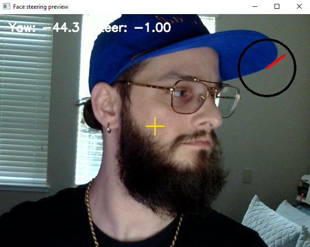

# AlohaMini1 Teleoperation

This folder packages the scripts used to teleoperate an AlohaMini1 with:

- a Raspberry Pi controlling the mobile base, lift, and follower arms
- a PC controlling pedals/keyboard, phone or face steering, and SO-101 leader arms
- HTTP links between the PC and Pi

No personal IP addresses, Windows COM ports, or Pi `/dev/serial/by-id` paths are hardcoded in the commands. Replace placeholders such as `<PI_IP>`, `<PC_WIFI_IP>`, and `<LEFT_FOLLOWER_PORT>` with values from your own robot.

## Folder layout

```text
teleoperate/
  pc/
    combined_gyro_pedal_control_remote.py   # PC sender for base/lift plus gyro or face steering
    so101_leader_http_sender.py             # PC sender for one SO-101 leader arm
  pi/
    aloha_pi_follower_agent_pyserial.py     # Pi receiver for base/lift servos
    so101_follower_http_agent.py            # Pi receiver for one SO-101 follower arm
    aloha_camera_dashboard.py               # Optional Pi camera dashboard and recorder
  templates/
    commands.md                             # Copy/paste command templates with placeholders
    pi_ports.md                             # How to discover stable Pi serial ports
  requirements-pc-pedals.txt
  requirements-pi-base.txt
```

## Network architecture

```text
PC pedals/keys/steering -> Pi port 9000 -> base and lift
PC left leader arm      -> Pi port 9011 -> left follower arm
PC right leader arm     -> Pi port 9012 -> right follower arm
optional Pi cameras     -> Pi port 9100 -> browser dashboard
```

Run each receiver/sender in its own terminal while bringing the robot up. After the setup is stable, these commands can be wrapped in shell or batch scripts.

## What you must provide

These files do not include robot-specific calibration or hardware identity data. Each user must provide:

- Raspberry Pi IP address, found on the Pi with `hostname -I`
- PC Wi-Fi IPv4 address, found on Windows with `ipconfig`
- Pi serial paths, found with `ls -l /dev/serial/by-id/`
- Windows leader arm COM ports, found with `lerobot-find-port` or Device Manager
- LeRobot calibration files/IDs for each SO-101 leader and follower arm
- correct base/lift servo IDs and signs for your wiring
- optional camera `/dev/v4l/by-path/...` names if using the camera dashboard

The working prototype used base servo IDs `9`, `8`, `10` and lift ID `11`, but do not assume those match your robot.

## Optional hardware references

These are not strict requirements; they are examples of hardware used during bring-up or hardware in the same style.

- USB foot pedals for base/lift keyboard input: [Amazon example](https://www.amazon.com/dp/B0B1ZJVZ2K?ref=ppx_pop_mob_ap_share)
- Phone holder / VR-style adapter for phone steering: [Amazon example](https://www.amazon.com/dp/B0B1ZJVZ2K?ref=ppx_pop_mob_ap_share)
- Webcam for face steering: [Logitech C270 HD webcam](https://www.amazon.com/Logitech-Desktop-Widescreen-Calling-Recording/dp/B004FHO5Y6)

Any equivalent device should work if it presents itself to the PC as keyboard input for pedals, or securely holds the phone while the browser page streams orientation data.
<p align="center">
  
  <br>
  <sub>Four-pedal base and lift control layout.</sub>
</p>

## Dependencies

### Raspberry Pi

Use the same Python environment that has LeRobot working for your follower arms. Install base/lift dependencies:

```bash
python3 -m pip install -r requirements-pi-base.txt
```

The arm receiver also needs LeRobot and the Feetech/scservo SDK stack used by SO-101 followers. If your LeRobot install reports `scservo_sdk` errors, reinstall the Feetech-enabled LeRobot dependencies for your version.

The optional camera dashboard requires `ffmpeg`:

```bash
sudo apt update
sudo apt install ffmpeg
```

### PC

Use the same conda environment that has LeRobot working for your leader arms. For the pedal/keyboard/steering sender:

```bat
python -m pip install -r requirements-pc-pedals.txt
```

`opencv-python`, `mediapipe`, and `numpy` are only needed for `--steering-mode face`. Phone gyro steering and keyboard/pedal control need `pynput`.

## Calibration files

LeRobot looks up calibration by the `--robot-id` or `--leader-id` you pass to the scripts. If follower arms move from the PC to the Pi, copy the follower calibration files from the PC to the Pi.

Typical PC location:

```text
C:\Users\<YOU>\.cache\huggingface\lerobot\calibration\robots\so_follower\
```

Typical Pi location:

```bash
~/.cache/huggingface/lerobot/calibration/robots/so_follower/
```

Example copy command from Windows:

```bat
scp "C:\Users\<YOU>\.cache\huggingface\lerobot\calibration\robots\so_follower\<FOLLOWER_ID>.json" <PI_USER>@<PI_IP>:/home/<PI_USER>/.cache/huggingface/lerobot/calibration/robots/so_follower/
```

Leader calibration files stay on the PC if the leader arms stay plugged into the PC.

## Bring-up order

1. Put the robot on blocks or otherwise make it safe before first motion.
2. Start the Pi base/lift receiver and verify `curl http://127.0.0.1:9000/status`.
3. Start one Pi follower arm receiver and verify `curl http://127.0.0.1:9011/status`.
4. Start the matching PC leader sender at low FPS, e.g. `--fps 10`.
5. Move the leader slowly and confirm direction/range.
6. Repeat for the second arm on port `9012`.
7. Start the PC base/lift/steering sender.
8. Only after each channel works independently should you operate base, lift, and both arms together.

## Command templates

See [`templates/commands.md`](templates/commands.md) for full copy/paste commands.

The most important placeholders are:

```text
<PI_IP>                    Raspberry Pi IP from hostname -I
<PC_WIFI_IP>               Windows Wi-Fi IPv4 from ipconfig
<BASE_LIFT_PORT>           Pi /dev/serial/by-id path for the base/lift servo bus
<LEFT_FOLLOWER_PORT>       Pi /dev/serial/by-id path for the left follower arm
<RIGHT_FOLLOWER_PORT>      Pi /dev/serial/by-id path for the right follower arm
<LEFT_LEADER_COM_PORT>     Windows COM port for the left leader arm
<RIGHT_LEADER_COM_PORT>    Windows COM port for the right leader arm
```

## Phone steering notes

The phone gyro page is served by the PC sender at:

```text
http://<PC_WIFI_IP>:8765
```

A phone holder or VR-style adapter can make phone steering easier to keep centered while driving. One example is listed in [Optional hardware references](#optional-hardware-references).

Android Chrome may block device orientation on insecure HTTP origins. If motion events are unavailable, either allow sensors for that site in Chrome settings, use face steering, or add a touch/slider steering fallback.

## Face steering notes

Face steering uses the PC camera and these main parameters. A standard USB webcam works; the optional hardware list includes one example used for this style of setup:

```text
--steering-mode face
--face-camera 0
--face-deadband 15
--face-max-yaw 40
--face-smoothing 0.2
--face-preview
```

Increase `--face-deadband` if tiny head movements cause unwanted turning. Increase/decrease `--turn-speed` to scale robot turning speed.
<table>
  <tr>
    <td align="center"></td>
    <td align="center"></td>
    <td align="center"></td>
  </tr>
  <tr>
    <td align="center"><strong>Center steering</strong></td>
    <td align="center"><strong>Left steering</strong></td>
    <td align="center"><strong>Right steering</strong></td>
  </tr>
</table>

## Safety controls

- Stop any terminal with `Ctrl+C`.
- The PC base/lift sender sends `/stop` on exit.
- The Pi base/lift receiver has a watchdog timeout and stops if commands stop arriving.
- Use `--activation-threshold` on arm receivers so follower arms do not move until the leader has moved away from the startup pose.
- Start with `--fps 10` for arms, then increase only after the mapping is verified.

## Scripts recovered from the working prototype

The packaged scripts correspond to the working split-PC/Pi teleoperation setup:

- `combined_gyro_pedal_control_remote.py` from the PC sender setup
- `so101_leader_http_sender.py` from the PC leader bridge
- `aloha_pi_follower_agent_pyserial.py` from the Pi base/lift receiver
- `so101_follower_http_agent.py` from the Pi follower arm receiver
- `aloha_camera_dashboard.py` from the optional Pi camera dashboard

If your local robot has newer versions, compare before replacing these. The bridge scripts include import fallbacks for the two LeRobot module layouts observed during bring-up: `so_*` and `so101_*`.
